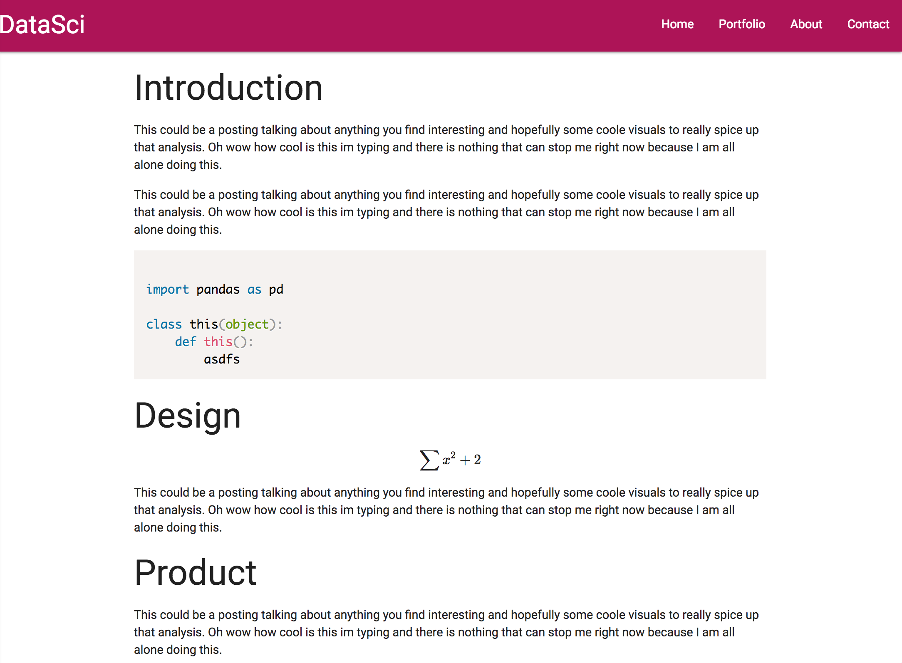

# DataSci

## Getting Started
- **Clone Repository**
- **Start Webapp**
    - `python app.py`
- **Open on [Local Machine](http://localhost:8888/)**

## Added Features
- **New Design**
- **Added Coding styles**
- **Added MathJax for Latex**

## TODO
- **Fix pagnation dynamically**
- **Add user accounts and database**
- **Add to server**
- **Fix dynamic url setting**
- **Add contacts and portfolio pages**
- **Create a logo**
- **Host the damn thing**
- **Add Content!**
    - Content Ideas
        - Introduction and examples to different algorithms
        - Natural Language processing with crypto currency
        - Some kaggle
        - Figure out how to add interactive plots
        - Figure out how to either add data to site or setup work area for analysis
        